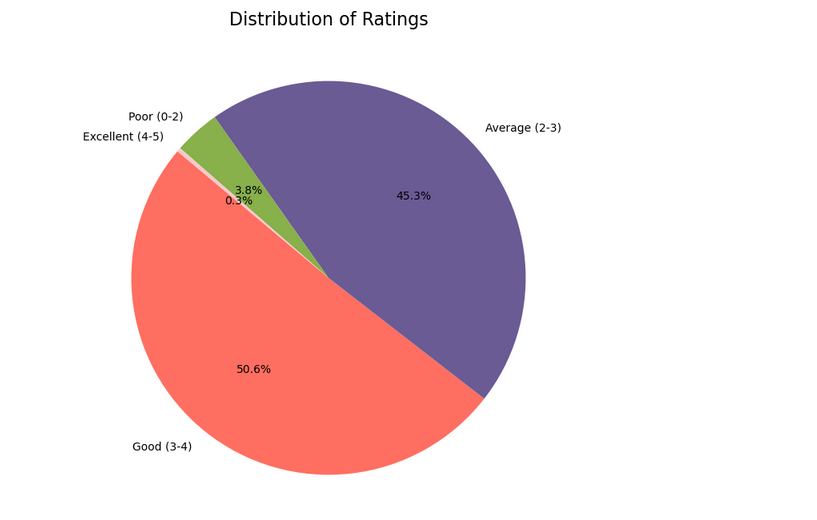
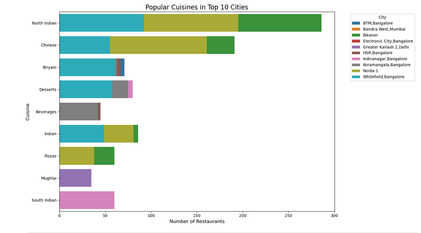
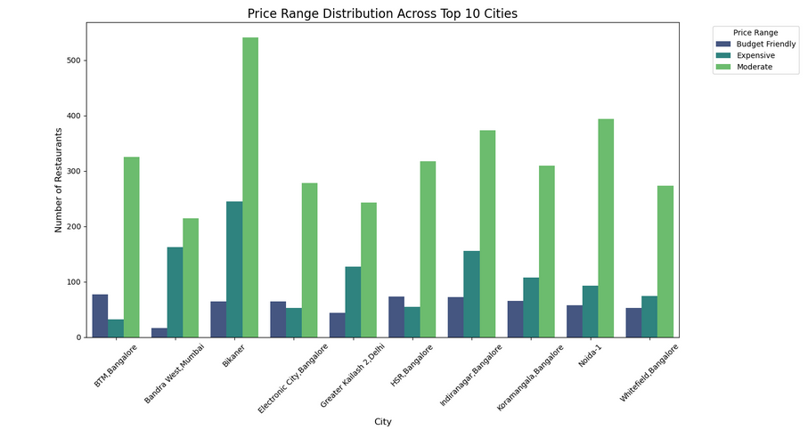
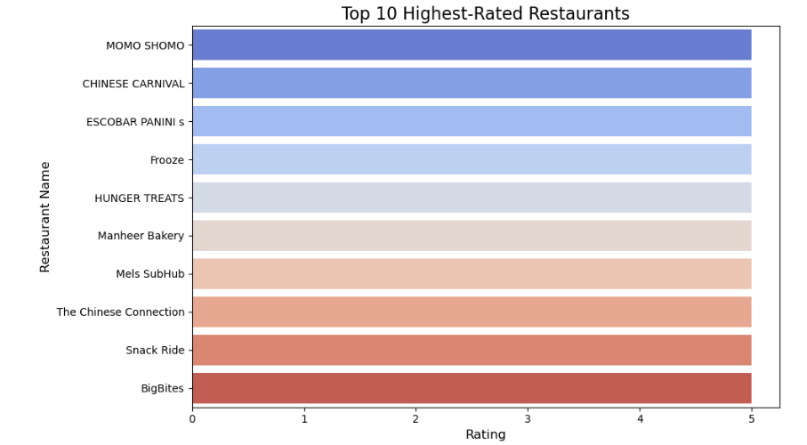
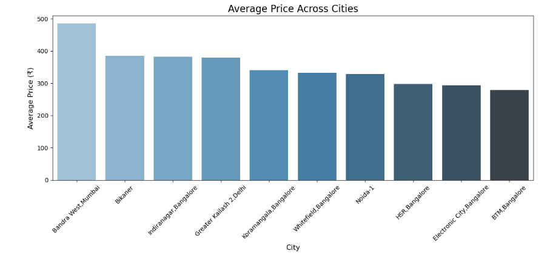

# 📊 Swiggy Data Analysis

This project focuses on analyzing Swiggy order and restaurant data to uncover trends, customer behavior, and performance insights. It uses Python and popular data science libraries for data cleaning, visualization, and exploratory analysis.

---

## 📁 Project Structure

```
.
├── sample.ipynb           # Jupyter notebook with analysis
├── data                   # to store raw or cleaned data
├── visuals/               # Folder for saving charts or figures
└── README.md              # Project documentation
```

---

## 🛠️ Technologies Used

- Python 3.8+
- Jupyter Notebook
- Pandas
- NumPy
- Matplotlib
- Seaborn

---

## 🚀 How to Run

1. Clone this repository or download the files.

2. Install dependencies:

```bash
pip install pandas numpy matplotlib seaborn jupyter
```

3. Launch the Jupyter Notebook:

```bash
jupyter notebook sample.ipynb
```

---

## 📌 Features

- Exploratory Data Analysis (EDA)
- Visual insights into:
  - Restaurant ratings
  - Price and delivery trends
  - Cuisine popularity
  - Customer preferences

---

## 📈 Visuals






